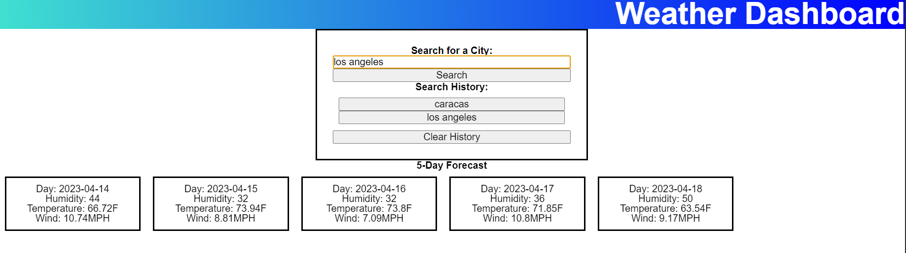

Project Title: Weather App

Description: Simple weather app that display a 5-day forecast of the weather from the city of your choice, as well as a search history to go back to previous searches. 

How to Use: There is no installation required. You can access the project using the provided link. Simply type the city in the search bar. After pressing search, you will be given 5 container displaying the date, and weather conditions of that date. Your search will also be added to the search history, which can be clicked to retreive that information again. If too many results are on the screen, you can clear it with the Clear History button.

Website Link:
-https://piersalloum.github.io/WeatherApp/

References: 
-https://developer.mozilla.org/en-US/docs/Web/API/Fetch_API/Using_Fetch
-https://www.topcoder.com/thrive/articles/fetch-api-javascript-how-to-make-get-and-post-requests
-https://javascript.info/async-await

Screenshot of the website:

License:

MIT License

Copyright (c) [2023] [PierSalloum]

Permission is hereby granted, free of charge, to any person obtaining a copy of this software and associated documentation files (the "Software"), to deal in the Software without restriction, including without limitation the rights to use, copy, modify, merge, publish, distribute, sublicense, and/or sell copies of the Software, and to permit persons to whom the Software is furnished to do so, subject to the following conditions:

The above copyright notice and this permission notice shall be included in all copies or substantial portions of the Software.

THE SOFTWARE IS PROVIDED "AS IS", WITHOUT WARRANTY OF ANY KIND, EXPRESS OR IMPLIED, INCLUDING BUT NOT LIMITED TO THE WARRANTIES OF MERCHANTABILITY, FITNESS FOR A PARTICULAR PURPOSE AND NONINFRINGEMENT. IN NO EVENT SHALL THE AUTHORS OR COPYRIGHT HOLDERS BE LIABLE FOR ANY CLAIM, DAMAGES OR OTHER LIABILITY, WHETHER IN AN ACTION OF CONTRACT, TORT OR OTHERWISE, ARISING FROM, OUT OF OR IN CONNECTION WITH THE SOFTWARE OR THE USE OR OTHER DEALINGS IN THE SOFTWARE.